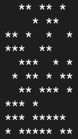

# Game of life

this project is implementation of [Game of Life](https://en.wikipedia.org/wiki/Conway%27s_Game_of_Life) in Rust.


## Life or death

for print the grid I just use `println!` macro. 


All characters in the grid are `' '` or `'*'` if the cell is alive he prints `'*'` otherwise `' '`.
The result is not very good but it works. at the future I can add a screen for get a better view.

## How to play

for run the game you need to use cargo with commande ```cargo run --release``` don't forget `--release` otherwise the project doesn't compile. you can install it on [this link](https://rustup.rs/).


